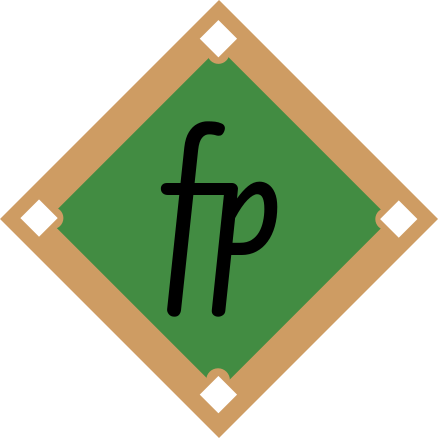

<center></center>

# diamondfp
**Comparing baseball players like molecules!** 

**Statistical fingerprints for baseball players — find their closest matches.**  

`diamondfp` is a Python library for generating **statistical fingerprints** of baseball players, enabling similarity searches much like molecular similarity in chemistry. By encoding player performance into binary feature vectors, you can compare players across eras and styles using metrics like the **Tanimoto coefficient/Jaccard Score**.  

Currently, `diamondfp` supports **binary and binned fingerprint generation** for batting stats, with pitching and fielding fingerprints in development.  

## Features  
- Create binary statistical fingerprints from player performance data  
- Compare players using similarity metrics (Tanimoto coefficient/Jaccard Score)  
- Easily extendable to batting, pitching, and fielding statistics  
- Works with historical and modern baseball data 

## Usage

```python
import pandas as pd
from diamondfp.fingerprints import binaryfp, binnedfp
from diamondfp.utils.features import generate_quantiles
from diamondfp.scoring import jaccard, manhattan, cosine_sim

df = pd.read_csv("data/career-batting.csv")

stat_features = {
    "H": [0.5, 0.75, 0.9, 0.95],
    "2B": [0.75, 0.95],
    "3B": [0.75, 0.95],
    "HR": [0.9, 0.99],
    "K%": [0.1, 0.25],
    "BB%": [0.75, 0.99],
    "AVG": [0.5, 0.75, 0.9, 0.95],
    "OBP": [0.5, 0.75, 0.9, 0.95],
    "SLG": [0.5, 0.75, 0.9, 0.95],
    "OPS": [0.5, 0.75, 0.9, 0.95],
}

feat_quants = generate_quantiles(df, stat_features)

babe_ruth = binaryfp(df[df["Name"] == "Babe Ruth"].squeeze(), feat_quants)
shohei_ohtani = binaryfp(df[df["Name"] == "Shohei Ohtani"].squeeze(), feat_quants)
sim_score = jaccard(babe_ruth, shohei_ohtani)
print(f"Jaccard score: {sim_score:0.2f}")  # 0.72
cos_sim = cosine_sim(babe_ruth, shohei_ohtani)
print(f"Cosine similarity: {cos_sim:0.2f}")  # 0.85
man_dist = manhattan(babe_ruth, shohei_ohtani)
print(f"Manhattan distance: {man_dist}")  # 5
```

## Example Usage

Examples to how to use `diamondfp` can be found [here](https://github.com/dlf57/diamondfp/blob/main/examples/examples.md)!

Example notebooks use the Lahman Baseball Database,
licensed under Creative Commons BY-SA 3.0.

### Roadmap

- [X] Binary vector fingerprints
- [X] Binned fingerprints
- [X] Clustering and visualization tools
- [ ] PyPI release

## License
This project is licensed under the MIT License. See the [LICENSE](https://github.com/dlf57/diamondfp/blob/main/LICENSE) file for details.